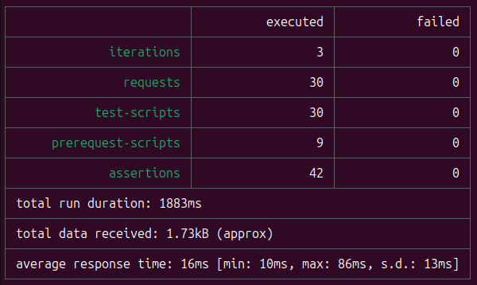

<h1>Summary</h1>

The repository contains a script that tests a fake API. As part of the tests, it sends various requests (GET, POST, PUT, PATCH, and DELETE) and checks the test result.

The requests use hardcoded data, but also data saved as local variables and global variables. The test also uses data pulled from a separate file. Some variables are dynamically generated during the test execution.

The test performs three iterations of the defined collection of requests and returns the test result. All assertions should get a "passed" result.
 

<h1>Requirements</h1>
For script to work properly, the following are required:

* Node.js installed (https://nodejs.org/en/download/package-manager)

* Installed json-server with fake API (https://github.com/typicode/json-server/tree/v0?tab=readme-ov-file#getting-started)

* Running json-server (json-server --watch db.json - should be run from the location where the locally cloned repository is located)

* Newman installed (npm install -g newman)

<h1>Files</h1>

<b>Adding posts and comments.postman_collection.json</b> – the main file containing a collection of requests along with assertion tests

<b>db.json</b> – a file with data

<b>comments.json</b> – a file from which comments are pulled during testing

<b>Dev.postman_environment.json</b> – a file with environment variables

<b>workspace.postman_globals.json</b> – a file with global variables

<h1>Starting up</h1>

newman run "Adding posts and comments.postman_collection.json" -e Dev.postman_environment.json -g workspace.postman_globals.json -d comments.json

